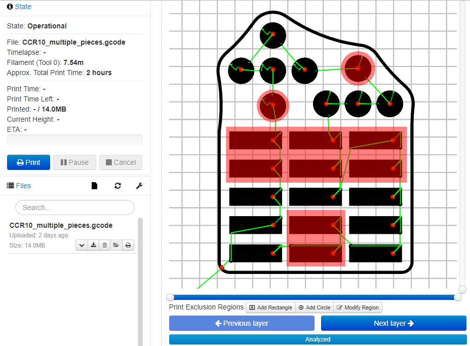

# Octoprint - Exclude Region Plugin

Imagine starting a long running, multi-part print job only to have one of the parts fail half-way
through.  If you allow the job to continue, that big mess of spaghetti-like extrusions within the
failed area are likely to get stuck to other pieces and lead to additional failures or blemishes
on the other parts (not to mention wasted filament) as the print goes on.

The intent of this plugin is to provide a means to salvage multi-part prints where one (or more)
of the parts has broken loose from the build plate or has otherwise become a worthless piece of
failure.  Instead of cancelling an entire job when only a portion is messed up, use this plugin
to instruct OctoPrint to ignore any gcode commands executed within the area around the failure.

You can dynamically define rectangular or circular exclusion regions for the currently selected
gcode file through OctoPrint's integrated gcode viewer, and those regions may be added or modified
before, during, or even after printing.

Some things to note about this plugin:

* It can only affect printing of files managed by OctoPrint, and can NOT exclude regions of files
  being printed from your printer's SD card.
* Use the exclude feature at your own risk.  It is recommended to only use it when a portion of
  your print has already failed.
* When defining regions, try to fully enclose all portions of the failed part that would otherwise
  still print.  You will get unpredictable results if you only exclude a portion of a part, and any
  overhangs on higher layers that extend outside an excluded region will have nothing to support
  them.
* This plugin makes several assumptions when filtering the gcode, some of which may not be correct
  for your printer's firmware.  It was developed with Marlin in mind, so should work reasonably well
  with firmware that replicates Marlin's behavior.
* The plugin only supports a single hotend at this time.  It is not recommended to attempt to use
  it on a gcode file with instructions for multiple hotends.
* Users of TouchUI will not be able to create or modify exclude regions.  Any defined regions will
  be displayed, but they cannot currently be manipulated on a touch device.

## Setup

Install via the bundled [Plugin Manager](https://github.com/foosel/OctoPrint/wiki/Plugin:-Plugin-Manager)
or manually using this URL:

    https://github.com/bradcfisher/OctoPrint-ExcludeRegionPlugin/archive/master.zip

## Configuration

The plugin currently utilizes the the value of the standard `G90/G91 overrides relative extruder mode` feature, as well as providing several plugin-specific configuration options.

## How it Works

The plugin intercepts all Gcode commands sent to your 3D printer by Octoprint while printing.  By inspecting the commands, the plugin tracks the position of the extruder, and, if the extruder moves into an excluded region, certain Gcode commands will be modified or filtered by the plugin to prevent physical movement and extrusion within that region.

The following Gcode commands are currently utilized by the plugin, and all others are simply passed through.

    G0 [X Y Z E F] - Linear move
    G1 [X Y Z E F] - Linear move
    G2 [E F R X Y Z] or G2 [E F I J X Y Z] - Clockwise Arc
    G3 [E F R X Y Z] or G3 [E F I J X Y Z] - Counter-Clockwise Arc

The above commands are inspected to update the tool position, and will not be transmitted to the printer if the tool is inside an excluded region.  Retractions are processed to ensure that the filament position is in the expected state when exiting an excluded region.

    G4 - dwell / delay

Delay commands are ignored when inside an excluded region to reduce oozing.  The default behavior for dwell commands may be changed in the plugin settings.

    G10 - Firmware retract (only if no P or L parameter.  If P (tool number) or L (offset mode) is provided, the command is assumed to be a tool/workspace offset and the command is passed through unfiltered)
    G11 - Firmware unretract

Firmware retractions are processed to ensure that the filament position is in the expected state when exiting an excluded region.

    G20 - Set units to inches
    G21 - Set units to mm
    G28 [X Y Z] - Home axis
    G90 - Absolute positioning mode
    G91 - Relative positioning mode
    G92 [X Y Z E] - Set current position
    M206 [P T X Y Z] - Set home offsets

The above commands are inspected to track the current tool position.

    M204 - Set accelerations
    M205 - Set advanced settings

By default, M204 and M205 are tracked while excluding, but only the last value set for each parameter is processed after exiting the excluded area.  This behavior is intended to reduce the amount of communication with the printer while processing excluded commands to reduce processing delays and oozing.  The behavior for these commands may be modified in the plugin settings.
